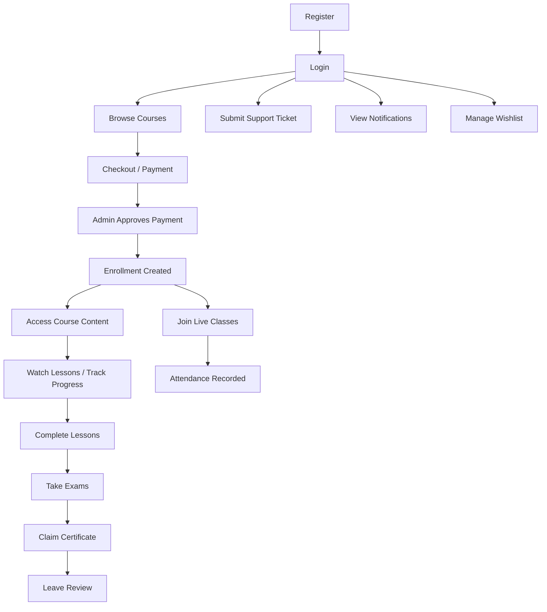
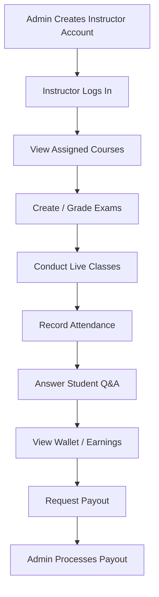

# ENGINEERING PIONEERS — BACKEND AUDIT REPORT (Part 2/2)
## Tasks 3 & 4: Test Scenarios + v1 API Documentation

---

# Task 3: Comprehensive Flow & Edge-Case Test Scenarios

## 3.1 End-to-End Student Flow



## 3.2 End-to-End Instructor Flow



---

## 3.3 Structured Test Cases

### AUTH MODULE

| # | Scenario | Type | Expected |
|---|----------|------|----------|
| A1 | Register with valid data | ✅ Happy | 201, returns user + tokens |
| A2 | Register with existing email | ❌ Negative | 409 `Email is already in use` |
| A3 | Register with password < 8 chars | ❌ Negative | 400 Zod error |
| A4 | Register with mismatched passwords | ❌ Negative | 400 `Passwords do not match` |
| A5 | Register with no letter in password | ❌ Negative | 400 Zod error |
| A6 | Login with valid credentials | ✅ Happy | 200, tokens + user |
| A7 | Login with wrong password | ❌ Negative | 401 `Invalid email or password` |
| A8 | Login with non-existent email | ❌ Negative | 401 `Invalid email or password` (same msg) |
| A9 | Login with deactivated account | ❌ Negative | 403 `Account deactivated` |
| A10 | Refresh with valid token | ✅ Happy | 200, new tokens |
| A11 | Refresh with expired token | ❌ Negative | 401 |
| A12 | Refresh with revoked token | ❌ Negative | 401 |
| A13 | Refresh after password change | ❌ Negative | 401 (all tokens deleted) |
| A14 | Change password with correct current | ✅ Happy | 200, all tokens revoked |
| A15 | Change password — same as current | ❌ Negative | 400 |
| A16 | Forgot password — valid email | ✅ Happy | 200 generic message |
| A17 | Forgot password — non-existent email | ✅ Alt | 200 same generic message |
| A18 | Reset password with valid token | ✅ Happy | 200 |
| A19 | Reset password with expired token | ❌ Negative | 400 |
| A20 | Logout without token | ✅ Alt | 200 success (graceful) |

### ENROLLMENT & PAYMENT

| # | Scenario | Type | Expected |
|---|----------|------|----------|
| E1 | Student checkout for package | ✅ Happy | 201, PENDING payment created |
| E2 | Checkout for fully booked class | ❌ Negative | 400 `Class is fully booked` |
| E3 | Admin approves valid PENDING payment | ✅ Happy | Enrollment created, status PAID |
| E4 | Admin approves already-PAID payment | ❌ Negative | 400 `Cannot approve` |
| E5 | Admin rejects payment | ✅ Happy | Status FAILED, subscription CANCELED |
| E6 | **EDGE**: Approve payment twice concurrently | ⚠️ Edge | Must be idempotent or error — NOT create duplicate enrollment |
| E7 | Access course content without enrollment | ❌ Negative | 403 |
| E8 | Access course content with expired sub | ⚠️ Edge | **CURRENTLY ALLOWED** — MUST block |
| E9 | Checkout with invalid packageId | ❌ Negative | 404 |
| E10 | Checkout without amount field | ❌ Negative | 400 (if validated) |

### PROGRESS TRACKING

| # | Scenario | Type | Expected |
|---|----------|------|----------|
| P1 | Track lesson access (heartbeat) | ✅ Happy | Progress upserted, time incremented |
| P2 | Mark lesson complete | ✅ Happy | Progress 100%, enrollment stats updated |
| P3 | Mark already-complete lesson again | ✅ Alt | Idempotent — returns existing (no extra writes) ✓ |
| P4 | Track without enrollment | ❌ Negative | 403 |
| P5 | Complete all lessons in course | ✅ Happy | `isCompleted: true`, certificate eligible |
| P6 | Resume course — has incomplete lesson | ✅ Happy | Returns first incomplete |
| P7 | Resume course — all complete | ✅ Alt | Returns last accessed |
| P8 | Resume course — no progress at all | ✅ Alt | Returns first lesson |
| P9 | **EDGE**: Two devices complete same lesson simultaneously | ⚠️ Edge | Unique constraint handles — upsert is safe ✓ |
| P10 | **EDGE**: watchPercentage > 100 sent | ⚠️ Edge | **NOT VALIDATED** — needs Zod clamp |

### EXAMS

| # | Scenario | Type | Expected |
|---|----------|------|----------|
| X1 | Get available exams (enrolled) | ✅ Happy | Returns exams for enrolled courses |
| X2 | Start exam | ✅ Happy | Submission created with startedAt |
| X3 | Start exam twice | ✅ Alt | Returns existing submission (P2002 caught) |
| X4 | Submit exam with answers | ✅ Happy | Auto-graded, score calculated |
| X5 | Submit already-submitted exam | ❌ Negative | 400 `Already submitted` |
| X6 | View submission result | ✅ Happy | Returns answers with correct answers revealed |
| X7 | View another student's result | ❌ Negative | 403 |
| X8 | Get exam details without enrollment | ❌ Negative | 403 |
| X9 | **EDGE**: Submit after time expires | ⚠️ Edge | **CURRENTLY ALLOWED** — MUST reject |
| X10 | **EDGE**: Start EXPIRED/UPCOMING exam | ⚠️ Edge | **CURRENTLY ALLOWED** — MUST check status |
| X11 | **EDGE**: Submit with missing questionIds | ⚠️ Edge | Treated as null — needs validation |

### CERTIFICATES

| # | Scenario | Type | Expected |
|---|----------|------|----------|
| C1 | Claim after 100% completion | ✅ Happy | PDF generated + DB record |
| C2 | Claim without completion | ❌ Negative | 400 `Not fully completed` |
| C3 | Claim twice | ❌ Negative | 400 `Already claimed` |
| C4 | Claim without enrollment | ❌ Negative | 403 |
| C5 | Verify certificate by serial | ✅ Happy | Returns certificate data |
| C6 | Verify with invalid serial | ❌ Negative | 404 |

### PAYOUTS (INSTRUCTOR + ADMIN)

| # | Scenario | Type | Expected |
|---|----------|------|----------|
| W1 | View wallet balance | ✅ Happy | Returns balance, earned, withdrawn |
| W2 | Request payout ≤ balance | ✅ Happy | PENDING payout created |
| W3 | Request payout > balance | ❌ Negative | 400 `Insufficient funds` |
| W4 | Admin approves payout (PAID) | ✅ Happy | Balance deducted, transaction logged |
| W5 | Admin approves payout with insufficient wallet | ❌ Negative | 400 |
| W6 | Admin rejects payout | ✅ Happy | Status REJECTED |
| W7 | Process already-PAID payout | ❌ Negative | 400 `Already processed` |
| W8 | **EDGE**: 5 concurrent payout requests | ⚠️ Edge | **RACE CONDITION** — see Task 2 |

### SUPPORT TICKETS

| # | Scenario | Type | Expected |
|---|----------|------|----------|
| T1 | Student creates ticket | ✅ Happy | 201, ticket with initial message |
| T2 | Student replies to own ticket | ✅ Happy | Message added |
| T3 | Student replies to other's ticket | ❌ Negative | 403 |
| T4 | Admin processes ticket (status + response) | ✅ Happy | Status updated, message added |
| T5 | Admin views all tickets with filter | ✅ Happy | Filtered results |

---

## 3.4 Critical Edge Cases Summary

| # | Edge Case | Current Status | Risk |
|---|-----------|---------------|------|
| 1 | Concurrent enrollment creation (approve twice) | ❌ Crashes P2002 | HIGH |
| 2 | Concurrent payout requests draining wallet | ❌ No lock | CRITICAL |
| 3 | Exam submission after time expires | ❌ No check | HIGH |
| 4 | Starting expired/upcoming exam | ❌ No check | HIGH |
| 5 | Content access with expired subscription | ❌ No check | HIGH |
| 6 | Large payload DoS (no body size limit) | ❌ No limit | MEDIUM |
| 7 | Brute force login (no rate limit) | ❌ No limit | CRITICAL |
| 8 | watchPercentage validation (>100 or negative) | ❌ No validation | LOW |
| 9 | Puppeteer crash during certificate generation | ❌ No fallback | MEDIUM |
| 10 | Coupon usage beyond maxUses (concurrent) | ❌ Not atomic | MEDIUM |

---

# Task 4: v1 API Documentation

## Base URL
```
https://api.engineeringpioneers.com/api/v1
```

## Common Headers
| Header | Value | Required |
|--------|-------|----------|
| `Content-Type` | `application/json` | All requests with body |
| `Authorization` | `Bearer <accessToken>` | All 🔐 endpoints |

## Standard Response Envelope
```typescript
// Success
{ success: true, message: string, data: T, results?: number, meta?: object }

// Error
{ success: false, message: string, stack?: string /* dev only */ }
```

---

## 1. AUTH & RECOVERY

### `POST /auth/register` 🔓
**Description**: Register a new student account.

**Request Body**:
```typescript
{
  fullName: string;          // min 3, max 100
  email: string;             // valid email
  password: string;          // min 8, must contain letter + number
  confirmPassword: string;   // must match password
  phone?: string;            // optional, format: +1234567890
}
```

**Success Response** `201`:
```json
{
  "success": true,
  "message": "User registered successfully",
  "data": {
    "user": {
      "id": "uuid",
      "fullName": "Mohamed Ahmed",
      "email": "mo@example.com",
      "role": "STUDENT",
      "createdAt": "2026-05-01T00:00:00.000Z"
    },
    "tokens": {
      "accessToken": "eyJhbGci...",
      "refreshToken": "eyJhbGci..."
    }
  }
}
```

**Error Responses**:
| Code | Message |
|------|---------|
| 400 | `Invalid input data: body.password: Password must be at least 8 characters` |
| 409 | `Email is already in use.` |

---

### `POST /auth/login` 🔓

**Request Body**:
```typescript
{ identifier: string; password: string; }
```

**Success** `200`: Returns user object with tokens (same shape as register).

**Errors**: `401` Invalid credentials · `403` Account deactivated

---

### `POST /auth/logout` 🔓

**Request Body**: `{ refreshToken?: string }`

**Success** `200`: `{ loggedOut: true }`  
**Note**: Always succeeds even without token.

---

### `POST /auth/refresh` 🔓

**Request Body**: `{ refreshToken: string }`

**Success** `200`: `{ tokens: { accessToken, refreshToken } }`

**Errors**: `400` Missing token · `401` Invalid/expired token

---

### `POST /auth/forgot-password` 🔓

**Request Body**: `{ email: string }`

**Success** `200`: `{ message: "If this email exists, a reset link has been sent." }`  
**Note**: Always returns same message (security). In dev mode, `resetToken` is included.

---

### `POST /auth/reset-password/:token` 🔓

**Request Body**: `{ newPassword: string; confirmNewPassword: string; }`

**Success** `200`: `{ message: "Password reset successfully." }`

**Errors**: `400` Invalid/expired token · `400` Validation errors

---

## 2. PROFILE

### `GET /profile/me` 🔐

**Success** `200`:
```json
{
  "data": {
    "id": "uuid", "email": "...", "fullName": "...",
    "phone": null, "avatar": null, "role": "STUDENT",
    "bio": null, "experience": null, "averageRating": 0,
    "customRole": null
  }
}
```

### `PATCH /profile/me` 🔐

**Allowed Fields**: `fullName`, `phone`, `bio`, `experience`

---

## 3. ADMIN — USER MANAGEMENT

### `GET /admin/users` 🛡️
**Query Params**: `?page=1&limit=10&role=STUDENT&search=keyword`

### `GET /admin/users/:id` 🛡️

### `PATCH /admin/users/:id` 🛡️
**Body**: Any user field (role, isActive, etc.)

### `DELETE /admin/users/:id` 🛡️
**Error**: `400` if user has financial history (Restrict)

---

## 4. COURSES (Public)

### `GET /courses` 🔓
**Query**: `?page=1&limit=10&categoryId=...&search=Chinese`

**Success** `200`:
```json
{
  "data": {
    "courses": [
      { "id": "uuid", "title": "HSK 2", "thumbnail": "...", "instructor": { "fullName": "..." }, "category": { "name": "..." } }
    ],
    "pagination": { "total": 50, "page": 1, "limit": 10, "totalPages": 5 }
  }
}
```

### `GET /courses/:id` 🔓
Returns full course with units, lessons, and instructor.

---

## 5. STUDENT — COURSES

### `GET /student/courses` 👤
Lists enrolled courses.

### `GET /student/courses/:courseId/content` 👤
Returns units and lessons for enrolled course.
**Error**: `403` Not enrolled

### `GET /student/courses/:courseId/exams` 👤
Returns exams for enrolled course.

---

## 6. STUDENT — PROGRESS

### `POST /student/progress/lessons/:lessonId/access` 👤
**Body**: `{ watchPercentage?: number }`
Heartbeat tracking — increments time spent.

### `POST /student/progress/lessons/:lessonId/complete` 👤
Marks lesson complete. Updates enrollment progress. Idempotent.

### `GET /student/progress/courses/:courseId/resume` 👤
**Success** `200`:
```json
{ "data": { "lessonId": "uuid", "title": "Lesson 8", "strategy": "FIRST_INCOMPLETE" } }
```

### `GET /student/progress/courses/:courseId/stats` 👤
```json
{ "data": { "completedLessons": 12, "percentage": 75.5, "isCourseCompleted": false } }
```

---

## 7. STUDENT — FINANCIALS

### `POST /student/financials/checkout` 👤
**Body**:
```typescript
{
  packageId?: string;
  courseId?: string;
  classId?: string;
  isYearly?: boolean;
  paymentMethod?: string;  // "INSTAPAY", "VODAFONE_CASH", etc.
  receiptUrl?: string;
  amount: number;
}
```
**Success** `201`: Returns PENDING payment record.
**Error**: `400` Class fully booked · `404` Package/Course not found

### `GET /student/financials/payments` 👤
### `GET /student/financials/subscriptions` 👤

---

## 8. STUDENT — EXAMS

### `GET /student/exams` 👤
Available exams across all enrolled courses.

### `GET /student/exams/:examId` 👤
Exam details with questions (NO correct answers).

### `POST /student/exams/:examId/start` 👤
Creates submission record. Idempotent.

### `POST /student/exams/:examId/submit` 👤
**Body**:
```typescript
{ answers: Array<{ questionId: string; answerText: string }> }
```
**Success** `200`: `{ totalScore: 85, isPassed: true }`
**Error**: `400` Already submitted · `404` No submission found

### `GET /student/exams/submissions/:submissionId` 👤
Returns full results with correct answers.

---

## 9. STUDENT — CERTIFICATES

### `POST /student/courses/:courseId/certificates/claim` 👤
**Success** `200`: Returns PDF buffer (Content-Type: application/pdf)
**Errors**: `400` Not completed · `400` Already claimed · `403` Not enrolled

### `GET /student/certificates` 👤
Lists all student's certificates.

---

## 10. STUDENT — CLASSES

### `GET /student/classes` 👤
### `GET /student/classes/:id` 👤
### `POST /student/classes/:id/enroll` 👤
### `DELETE /student/classes/:id/unenroll` 👤

---

## 11. STUDENT — Q&A

### `GET /student/lessons/:lessonId/questions` 👤
### `POST /student/lessons/:lessonId/questions` 👤
**Body**: `{ title: string; body: string }`

### `POST /student/questions/:questionId/answers` 👤
**Body**: `{ body: string }`

---

## 12. STUDENT — REVIEWS

### `POST /student/courses/:courseId/reviews` 👤
**Body**: `{ rating: number; comment?: string }` (rating 1-5)

---

## 13. STUDENT — WISHLIST

### `GET /student/wishlist` 👤
### `POST /student/wishlist/:courseId` 👤
### `DELETE /student/wishlist/:courseId` 👤

---

## 14. STUDENT — RESOURCES

### `GET /student/resources/lessons/:lessonId` 👤
Returns lesson resources (PDFs, files). Enrollment validated.

---

## 15. STUDENT — COUPONS

### `POST /student/coupons/validate` 👤
**Body**: `{ code: string; targetType: string; targetId: string }`

---

## 16. SUPPORT TICKETS

### `POST /student/tickets` 👤👨‍🏫
**Body**: `{ subject: string; description: string; priority?: "LOW"|"MEDIUM"|"HIGH"|"URGENT" }`

### `GET /student/tickets` 👤👨‍🏫
### `POST /student/tickets/:id/message` 👤👨‍🏫
**Body**: `{ message: string }`

---

## 17. INSTRUCTOR — WALLET

### `GET /instructor/wallet` 👨‍🏫
```json
{ "data": { "balance": 1250.00, "totalEarned": 5000.00, "totalWithdrawn": 3750.00 } }
```

### `GET /instructor/wallet/transactions` 👨‍🏫
**Query**: `?page=1&limit=10`

### `POST /instructor/wallet/payouts` 👨‍🏫
**Body**: `{ amount: number }`
**Error**: `400` Insufficient funds

---

## 18. INSTRUCTOR — CLASSES

### `GET /instructor/classes` 👨‍🏫
### `POST /instructor/classes/:id/attendance` 👨‍🏫

---

## 19. INSTRUCTOR — Q&A

### `GET /instructor/lessons/:lessonId/questions` 👨‍🏫
### `POST /instructor/questions/:questionId/answers` 👨‍🏫

---

## 20. ADMIN — COURSES

### `GET /admin/courses` 🛡️ (with pagination + filters)
### `GET /admin/courses/:id` 🛡️
### `POST /admin/courses` 🛡️
**Body**: `{ title, description?, thumbnail?, instructorId, categoryId?, isActive? }`

### `PATCH /admin/courses/:id` 🛡️
### `DELETE /admin/courses/:id` 🛡️
### `PATCH /admin/courses/:id/assign-instructor` 🛡️

---

## 21. ADMIN — UNITS & LESSONS

### `POST /admin/units` 🛡️
### `PATCH /admin/units/:id` 🛡️
### `DELETE /admin/units/:id` 🛡️
### `POST /admin/lessons` 🛡️
### `PATCH /admin/lessons/:id` 🛡️
### `DELETE /admin/lessons/:id` 🛡️

---

## 22. ADMIN — FINANCIALS

### `GET /admin/financials/payments` 🛡️ `?status=PENDING&studentId=...`
### `GET /admin/financials/payments/:id` 🛡️
### `PATCH /admin/financials/payments/:id/approve` 🛡️
### `PATCH /admin/financials/payments/:id/reject` 🛡️
### `PATCH /admin/financials/payments/:id/status` 🛡️

---

## 23. ADMIN — PAYOUTS

### `GET /admin/payouts` 🛡️ `?status=PENDING&page=1&limit=10`
### `GET /admin/payouts/:id` 🛡️
### `PATCH /admin/payouts/:id/process` 🛡️
**Body**: `{ status: "APPROVED"|"REJECTED"|"PAID"; adminNotes?: string }`

### `PATCH /admin/instructors/:instructorId/commission` 🛡️
**Body**: `{ commissionRate: number }` (0-100)

---

## 24. ADMIN — CMS

### `GET /admin/cms/sections` 🛡️
### `POST /admin/cms/sections` 🛡️
### `DELETE /admin/cms/sections/:id` 🛡️
### `GET|POST /admin/cms/faq` 🛡️
### `PATCH|DELETE /admin/cms/faq/:id` 🛡️
### `GET /admin/cms/reviews` 🛡️
### `PATCH /admin/cms/reviews/:id/feature` 🛡️
### `PATCH /admin/cms/reviews/:id/toggle` 🛡️
### `GET|POST /admin/cms/packages` 🛡️
### `PATCH /admin/cms/packages/:id` 🛡️
### `PATCH /admin/cms/packages/:id/status` 🛡️

---

## 25. ADMIN — DASHBOARD

### `GET /admin/dashboard/stats` 🛡️
```json
{
  "data": {
    "totalStudents": 1250,
    "totalInstructors": 15,
    "totalRevenue": 45000.00,
    "pendingPayouts": 3,
    "activeCourses": 12
  }
}
```

---

## 26. ADMIN — TICKETS

### `GET /admin/tickets` 🛡️ `?status=OPEN&priority=HIGH`
### `GET /admin/tickets/:id` 🛡️
### `PATCH /admin/tickets/:id/process` 🛡️
**Body**: `{ status: "IN_PROGRESS"|"RESOLVED"|"CLOSED"; response?: string }`

---

## 27. PUBLIC

### `GET /public/landing-page` 🔓
Power endpoint returning all home page sections, FAQs, featured reviews, packages.

### `GET /courses` 🔓
### `GET /courses/:id` 🔓
### `GET /courses/:courseId/reviews` 🔓
### `GET /packages` 🔓
### `GET /categories` 🔓
### `GET /instructors` 🔓
### `GET /instructors/:id` 🔓
### `GET /certificates/verify/:serialNumber` 🔓

---

## 28. NOTIFICATIONS ⚠️ (Stub Only)

### `GET /notifications` 🔐 — **NOT IMPLEMENTED**
### `PATCH /notifications/:id/read` 🔐 — **NOT IMPLEMENTED**
### `PATCH /notifications/read-all` 🔐 — **NOT IMPLEMENTED**

---

## Error Code Reference

| Code | Meaning | Example |
|------|---------|---------|
| 400 | Bad Request / Validation | Invalid input, business rule violation |
| 401 | Unauthorized | Invalid/expired token, wrong credentials |
| 403 | Forbidden | Wrong role, not enrolled, account deactivated |
| 404 | Not Found | Resource doesn't exist |
| 409 | Conflict | Duplicate email, duplicate enrollment |
| 500 | Server Error | Unexpected database error, Puppeteer crash |
